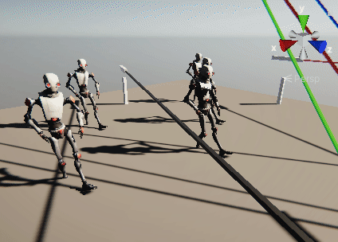
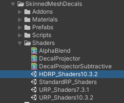

# Unity Skinned Mesh Renderer Decals

An example of how to create efficient projected decals on moving skinned meshes. This should work on all render pipelines, though HDRP is what this project is built on.

## Usage

1. Install the SkinnedMeshDecals package by adding `https://github.com/naelstrof/SkinnedMeshDecals.git#upm` through the Package Manager's "Add package from git URL". (Or use the openupm badge above.)
2. Install the relevant Shaders unity package based on which render system you're using.

3. Enable "Lightmap generation" in the target models' import settings, or ensure that models have atlased uv2s so that decals can be mapped to any part of the mesh.
4. Apply a material to the target model's mesh that has a `_DecalColorMap` input, and uses UV2 only for the `_DecalColorMap`. I use AmplifyShaderEditor to create the shaders for it, this is the only pipeline dependant part! You can also simply use one of the URP, HDRP, or Standard shader examples that are included in the package's Shaders folder.
5. Ensure your decal textures, the ones that you'll be splattering, each have mipmapping disabled, and have texture wrap set to clamped. **This is important!** Otherwise the decals will cover the whole model.
6. Create a script that calls `SkinnedMeshDecals.PaintDecal.RenderDecal(...)` with the target being one of the renderers you've set up. It should let you draw decals!

## Installation

You can install this package either by adding by adding `https://github.com/naelstrof/SkinnedMeshDecals.git#upm` through the Package Manager's "Add package from git URL" or by using the openupm badge above.

# Detailed explanation

This patreon post and the youtube video below describe all the technologies used here really well:

https://www.patreon.com/posts/skinned-mesh-22015350

https://www.youtube.com/watch?v=c7HBxBfCsas
